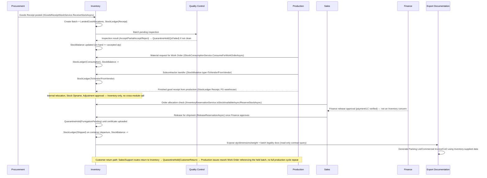

# Module Log: Inventory

> Session-by-session implementation history for `Modules/Inventory/**` (Stock Balance, Stock Mutation, Stock Opname, Batch/Grade tracking, Landed Cost, Quarantine). Cross-cutting architecture decisions/conventions live in [../plan.md](../plan.md).

## Design Phase: Scope defined (no code yet)
Next module in the build order after Master Data (`Identity → Settings → Master Data → Inventory → Procurement → Production → ...`). Business requirements gathered from the workflow narrative below (kept as the original source-of-truth requirement doc), covering the full Procure-to-Ship cycle for an export/manufacturing company (rattan raw material → semi-finished → finished goods). That narrative spans multiple future modules, so the technical scope that follows it is the **Inventory-owned slice only** — everything else (PO approval, Work Orders, Export Documentation, Finance release) belongs to its own module per the isolation rule in [AGENTS.md](../../AGENTS.md) and is consumed/exposed only via `Shared/Contracts/`.

### Why these boundaries
The workflow narrative groups by *business phase* (Inbound → Production → Warehouse Audit → Outbound → Export Docs), which crosses several modules. Mapped to module ownership:

| Workflow phase | Owning module | Inventory's slice |
|---|---|---|
| 1. Procurement PO + approval | Procurement | — (Inventory only reacts to Goods Receipt via contract call) |
| 1. Goods receipt, batch/legality capture, landed cost, QC gate | **Inventory** (+ Procurement triggers it, QC owns the inspection decision) | Stock Receipt, Batch, Landed Cost allocation |
| 2. Work Order, material consumption, subcontractor transfer | Production (+ **Inventory** executes the stock movement) | Stock Mutation (internal / to-vendor / from-vendor), Stock Ledger |
| 2. Scrap/damage write-off approval | Production/Finance decides, **Inventory** posts the movement | Stock Ledger (Adjustment type) |
| 3. Internal relocation, stock opname, adjustment approval | **Inventory** | Stock Opname, Stock Ledger |
| 3. Customer return → quarantine → rework | Production owns rework Work Order, **Inventory** owns the quarantine holding state | Quarantine Hold |
| 4. Order allocation, finance release approval | Sales/Finance | — |
| 4. Quarantine/fumigation hold before container loading, stock cut on departure | **Inventory** | Quarantine Hold (fumigation), Stock Ledger (Shipped) |
| 5. Export document generation | Export Documentation | — (Inventory just exposes qty/dimensions/weight via contract) |

### Entities (proposed, `MasterData_Items`/`Setting_Warehouses`/`Setting_UnitsOfMeasurement` are FK-only, no cross-module namespace reference)
All tables prefixed `Inventory_`, `BIGINT IDENTITY` PKs, standard audit columns (`CreatedAt/By`, `UpdatedAt/By`, `IsDeleted`, `DeletedAt/By`), per repo convention.

1. **`Inventory_Batches`** — traceability + legality unit. `Code` (batch/lot number), FK→`MasterData_Items`, `Grade`, FK→`Setting_Warehouses` (received-at), `ReceivedDate`, `LegalityDocumentType` (`SVLK`/`FSC`/`Other`), `LegalityDocumentNumber`, `LegalityDocumentUrl`, `SourceReference` (PO/GR number, string — no FK to Procurement).
2. **`Inventory_LandedCostAllocations`** — one-to-many per batch. FK→Batch, `CostType` (`Freight`/`Insurance`/`Handling`/`Duty`/`Other`), `Amount`, `CurrencyId` (FK→`Setting_Currencies`), `Notes`.
3. **`Inventory_StockBalances`** — current on-hand snapshot. FK→`MasterData_Items`, FK→`Setting_Warehouses`, FK→`Inventory_Batches` (nullable — not every movement is batch-tracked), `QuantityOnHand`, `QuantityReserved`, `QuantityInQuarantine`, `UnitOfMeasureId` (FK→`Setting_UnitsOfMeasurement`). `UNIQUE(ItemId, WarehouseId, BatchId)`.
4. **`Inventory_StockLedgers`** — immutable movement audit trail (kartu stok), append-only. FK→Item, FK→Warehouse, FK→Batch (nullable), `MovementType` (`Receipt`/`Mutation`/`ToVendor`/`FromVendor`/`Consumption`/`Adjustment`/`Reservation`/`Release`/`Shipped`), `QuantityChange` (signed), `ReferenceType`/`ReferenceId` (polymorphic pointer to the source transaction — Mutation/Opname/etc., resolved by string discriminator, not FK, since the source may live in another module), `MovementDate`.
5. **`Inventory_StockMutations`** (header) + **`Inventory_StockMutationLines`** — internal transfer between warehouses, or transfer to/from an external subcontractor (maklon) location. Header: `MutationNumber` (generated via `DocumentNumberGeneratorService.GetNextNumberAsync("StockMutation")`, never hand-entered), `MutationType` (`Internal`/`ToVendor`/`FromVendor`), FK→SourceWarehouse, FK→DestinationWarehouse (nullable when `ToVendor`/`FromVendor` — destination is an external party, stored as free-text `VendorReference` instead of FK to keep Inventory decoupled from MasterData's BusinessPartner concept beyond a label), `MutationDate`, `Status` (`Draft`/`Approved`/`Completed`). Lines: FK→Header, FK→Item, FK→Batch (nullable), `Quantity`.
6. **`Inventory_StockOpnames`** (header) + **`Inventory_StockOpnameLines`** — physical count reconciliation. Header: `OpnameNumber` (generated via `DocumentNumberGeneratorService.GetNextNumberAsync("StockOpname")`), FK→Warehouse, `OpnameDate`, `Status` (`Draft`/`WaitingApproval`/`Completed`), `CurrentApprovalLevel`. Lines: FK→Header, FK→Item, FK→Batch (nullable), `SystemQuantity` (snapshot at count time), `CountedQuantity`, `VarianceQuantity` (computed), `Notes`.

**Document numbering setup (`Setting_DocumentNumberings` seed rows needed for Inventory):**

| `DocumentType` | `Prefix` | `NumberLength` | `ResetPeriod` | `FormatTemplate` | Example output |
|---|---|---|---|---|---|
| `StockMutation` | `MUT/` | 4 | Yearly | `{Prefix}{Year}/{Number}` | `MUT/2026/0001` |
| `StockOpname` | `OPN/` | 4 | Monthly | `{Prefix}{Year}{Month}/{Number}` | `OPN/202608/0001` |

Field stores the final formatted string (e.g. `"MUT/2026/0001"`), not the raw counter — the raw `CurrentNumber` stays in `Setting_DocumentNumberings` only. Column naming follows the repo-wide `{Entity}Number` convention (not `Code`, not `Voucher` — `Code` is reserved for static master-data identifiers like `MasterData_Items.Code`).
7. **`Inventory_QuarantineHolds`** — generic hold state used both for inbound QC-failed batches, customer-return rework items, and outbound fumigation-pending finished goods. FK→Batch (nullable — outbound holds may be item+warehouse level instead of batch), FK→Item, FK→Warehouse, `HoldReason` (`QcFailed`/`CustomerReturn`/`FumigationPending`), `Status` (`OnHold`/`Released`/`Rejected`), `PlacedAt`, `ReleasedAt` (nullable), `ReleasedBy`, `Notes`.

### End-to-end flow (cross-module dependencies annotated)
Each swimlane below is a module; arrows crossing lanes go through a `Shared/Contracts/` interface, never a direct namespace reference. Same flow is echoed as a short "Dependency on Inventory" note in that module's own doc file (created/updated alongside this one) so it's visible from either side.

### Cross-module contract surface (`Shared/Contracts/`)
Per [../plan.md](../plan.md#L146-L152)'s example, Inventory both **implements** interfaces other modules call, and (later) **depends on** interfaces from Procurement/Production/Sales:
- `IInventoryReservationService` — `IsStockAvailableAsync(itemId, qty, warehouseId)`, `ReserveStockAsync(...)`, `ReleaseReservationAsync(...)` — implemented by Inventory, consumed by Sales (order allocation) and Production (material planning).
- `IGoodsReceiptStockService` — `ReceiveStockAsync(itemId, batchInfo, qty, warehouseId)` — implemented by Inventory, called by Procurement when a Goods Receipt is posted.
- `IStockConsumptionService` — `ConsumeForWorkOrderAsync(itemId, qty, warehouseId, workOrderReference)` — implemented by Inventory, called by Production.
- Inventory does **not** call into Procurement/Sales/Production directly for any of the above — those modules call Inventory's contract implementations; Inventory has no outbound dependency on them in this phase.

### Open decisions (need answer before writing migration scripts)
1. **Costing method** — average cost vs FIFO vs none-yet (defer HPP costing entirely to Finance later, Inventory only tracks qty not value). Leaning: defer value costing to Finance, Inventory Phase 1 = quantity + landed cost allocation only (no automatic weighted-average recompute).
2. **Warehouse master** — ~~reuse existing `Setting_Warehouses` as-is, or does it need new fields (capacity, warehouse type: Main/Quarantine/Vendor)~~ **Resolved**: `WarehouseType` (`Main`/`Quarantine`/`Vendor`) column added to `Setting_Warehouses`; `StockMutationUseCase.ValidateWarehouseTypesAsync` (via `IWarehouseDirectoryService`) now enforces it — Quarantine/Vendor warehouses cannot be used in an `Internal` mutation, and `ToVendor`/`FromVendor` mutations require the matching warehouse type on the vendor side.
3. **Batch tracking mandatory or optional** — doc mandates it for traceability/legality, so `Inventory_Batches` is not optional for raw-material receipts, but finished-goods-only items without legality requirements may skip it (hence `BatchId` nullable on Balances/Ledger).
4. **Numbering/approval** — `StockMutations`/`StockOpnames` need document numbers and approval gates; reuse Settings' existing Numbering/Approval Matrix infra (already built) rather than inventing a new one.

## Current known gaps / tech debt (Inventory)
- Not yet implemented — this file only defines the design as of this session; no entities, migrations, repositories, or UI exist yet.

## Session log

### Landed Cost Document redesign (header + lines, auto-allocation), WarehouseType validation, Warehouses UI restyle
- **Landed cost allocation formula — resolved**: kept in Inventory (not deferred to a future Finance module), matching SAP MM/Oracle LCM/Odoo Landed Costs precedent of keeping allocation math in Inventory/Purchasing since it directly affects `StockBalance.AverageCost`, a physical stock-valuation concern Inventory already owns via GoodsReceipt/StockMutation/StockOpname's weighted-average logic. Finance (when built) will only consume the posted documents for GL/AP purposes.
- Redesigned `Inventory_LandedCostAllocations` (previously a flat, manually-entered per-batch table with full CRUD) into a proper header+lines document workflow, matching the GoodsReceipt/StockMutation pattern:
  - `Inventory_LandedCostDocuments` (header): `DocumentNumber` (generated via `IDocumentNumberGeneratorService`, `DocumentType="LandedCost"`, prefix `LC/`), `GoodsReceiptId` (FK), `AllocationMethod` (`ByValue`|`ByQuantity`), `Status` (`Draft`|`Posted`), `Notes`.
  - `Inventory_LandedCostDocumentLines`: one row per cost item entered by the user — `CostType` (`Freight`/`Insurance`/`Handling`/`Duty`/`Other`), `Amount`, `CurrencyId`, `Notes`.
  - `Inventory_LandedCostAllocations` kept as the *output* table (not user-editable anymore) — gained nullable `LandedCostDocumentId` FK; rows are now only ever inserted by `LandedCostDocumentUseCase.PostAsync`, never via API POST/PUT (old Create/Update endpoints removed from `LandedCostAllocationsController`, which is now GetAll/GetById only).
  - `LandedCostDocumentUseCase.PostAsync` allocation math (ByValue): for each GoodsReceipt line, `share = (Quantity * UnitCost) / totalReceiptValue`; `allocatedAmount = totalCostLinesAmount * share`; inserts one `LandedCostAllocation` row per receipt line and updates the matching `StockBalance.AverageCost += allocatedAmount / QuantityOnHand`. Guards: Draft-only, GoodsReceipt lines must sum to a positive value, cost lines must be non-empty.
  - New API: `api/inventory/landed-cost-documents` (`GET`, `GET {id}`, `POST` create-draft, `POST {id}/post`), reusing `Batch_View`/`Batch_Create`/`Batch_Edit` permission policies (no dedicated LandedCost permission exists yet).
  - New UI: `LandedCostDocuments` Index/Create/Detail views following the established single-row-toolbar Index / single-card Detail standard (Post button shown only in Draft, "Allocation Results" section shown only once Posted); sidebar menu entry repointed from `LandedCostAllocations`/`Index` to `LandedCostDocuments`/`Index` via a data-only migration (`0061_Repoint_LandedCostAllocation_Menu.sql`) rather than adding a duplicate menu row.
  - Old `LandedCostAllocations` UI trimmed to a read-only list (no Create/Edit/Delete) for auditing purposes.
  - Migrations: `0028_LandedCostDocuments.sql` (Inventory), `0060_Seed_LandedCost_DocumentNumbering.sql` + `0061_Repoint_LandedCostAllocation_Menu.sql` (Settings) — applied.
- **WarehouseType validation for Stock Mutation**: added `IWarehouseDirectoryService` (`Shared/Contracts`, implemented by Settings) so Inventory can read a warehouse's `WarehouseType` without a cross-module namespace reference. `StockMutationUseCase.ValidateWarehouseTypesAsync` now rejects Quarantine/Vendor warehouses in `Internal` mutations and enforces the vendor-side warehouse type for `ToVendor`/`FromVendor` mutations.
- **Warehouses UI restyle**: `Views/Warehouses/Index.cshtml` and its controller rewritten to match the Inventory module's established Index convention (single-row toolbar, Filter dropdown with badge-dot when active, `_DeleteConfirmModal` partial) instead of its previous bespoke two-row filter layout and custom delete modal; added a `warehouseType` filter.

## Appendix: Original business workflow narrative (source requirement, Bahasa Indonesia)
Rangkuman alur kerja Modul Inventory ERP yang menggabungkan pergerakan fisik barang, gerbang persetujuan otomatis, serta elemen tingkat lanjut seperti biaya total perolehan, maklon, karantina, dan pelacakan legalitas khusus untuk industri manufaktur dan ekspor. Disusun berurutan sebagai referensi requirement (bukan struktur teknis — lihat pemetaan modul di atas).

### Alur Kerja Komprehensif Modul Inventory ERP (Perusahaan Ekspor)

### Fase 1: Pengadaan dan Penerimaan Bahan Baku (Inbound)

1. **Pembuatan Pesanan:** Staf membuat dokumen pesanan pembelian bahan baku ke pemasok.
2. **[Gerbang Approval] Pembelian:** Manajer Pembelian mengevaluasi pesanan. Jika nilainya melampaui batas tertentu, sistem meneruskannya ke Direktur.
3. **Penerimaan Barang (Pemindaian Barcode/RFID):** Pemasok mengirimkan material. Staf gudang memindai label pada material di area penerimaan agar data masuk ke sistem secara seketika tanpa input manual.
4. **Pencatatan Legalitas (Traceability):** Saat material masuk, staf menginput nomor angkatan produksi dan melampirkan dokumen legalitas (seperti sertifikat SVLK atau FSC) ke dalam sistem untuk memastikan asal-usul kayu atau rotan dapat dilacak di kemudian hari.
5. **Perhitungan Biaya Total Perolehan (Landed Cost):** Sistem secara otomatis menambahkan biaya ongkos kirim, asuransi, bongkar muat, dan bea masuk ke dalam harga pokok material, sehingga nilai aset di gudang menjadi sangat presisi.
6. **Inspeksi Kualitas:** Tim kualitas mengecek spesifikasi fisik bahan baku.
7. **[Gerbang Approval Khusus] Kualitas:** Jika ada spesifikasi yang kurang sesuai, Manajer Gudang dan Manajer Kualitas harus menyetujui di sistem apakah barang tersebut diretur, diterima sebagian, atau ditolak.
8. **Penempatan ke Rak:** Bahan baku yang lolos ditempatkan ke lokasi penyimpanan, dan stok di sistem bertambah.

### Fase 2: Proses Produksi dan Subkontraktor (Manufaktur)

1. **Pembuatan Perintah Kerja:** Tim produksi menyusun jadwal perakitan dan daftar kebutuhan material berdasarkan resep komponen.
2. **[Gerbang Approval] Produksi:** Manajer Produksi menyetujui perintah kerja setelah mengecek kapasitas mesin dan ketersediaan pengrajin.
3. **Penarikan Material:** Staf memindai *barcode* bahan baku yang ditarik dari gudang. Sistem memotong stok dan mengubah status nilainya menjadi barang dalam proses.
4. **Pengerjaan Subkontraktor / Maklon (Opsional):** Jika sebagian proses (misalnya penganyaman rotan) diserahkan ke pihak ketiga, sistem akan melakukan transfer stok ke Gudang Vendor. Aset tetap tercatat milik perusahaan dan akan berubah menjadi barang setengah jadi ketika dikembalikan ke pabrik.
5. **[Gerbang Approval Khusus] Penghapusan Stok:** Jika ada material rusak atau cacat produksi, laporan kerusakan wajib disetujui oleh Manajer Produksi atau Keuangan untuk menghindari kebocoran aset.
6. **Penyelesaian Produksi:** Produk jadi lolos inspeksi akhir dan dipindahkan ke gudang utama. Stok barang dalam proses berkurang, stok barang jadi bertambah.

### Fase 3: Pemeliharaan, Audit, dan Retur Gudang

1. **Perpindahan Internal:** Produk dipindahkan antar area atau rak menggunakan pemindai pintar untuk efisiensi ruang gudang.
2. **Penghitungan Fisik (Stock Opname):** Pencocokan jumlah fisik dengan data di sistem dilakukan secara rutin menggunakan alat pemindai.
3. **[Gerbang Approval] Penyesuaian Stok:** Jika ditemukan selisih barang akibat hilang atau rusak, penyesuaian angka di sistem wajib diinvestigasi dan disetujui oleh Manajer Gudang atau Tim Audit.
4. **Penerimaan Retur dan Pengerjaan Ulang (Rework):** Jika ada klaim pengembalian barang dari pembeli luar negeri, sistem akan mengarahkan barang tersebut ke Gudang Karantina agar tidak tercampur dengan stok sehat. Sistem kemudian menerbitkan perintah kerja baru khusus untuk perbaikan tanpa mengulang siklus produksi awal.

### Fase 4: Proses Karantina dan Pemenuhan Ekspor (Outbound)

1. **Alokasi Pesanan:** Pesanan dari luar negeri masuk, dan sistem langsung mengunci stok barang jadi yang bersangkutan.
2. **[Gerbang Approval] Pelepasan Keuangan:** Departemen Keuangan memberikan persetujuan pelepasan barang setelah memverifikasi validitas pembayaran atau instrumen kredit ekspor dari pembeli.
3. **Karantina dan Fumigasi:** Sistem mengunci sementara status barang jadi yang dialokasikan. Staf tidak bisa memuat barang ke kontainer sebelum proses fumigasi antijamur selesai dan sertifikatnya diunggah ke dalam sistem.
4. **Pengambilan dan Pemuatan:** Staf mengambil barang dengan panduan pemindai. Sistem otomatis menghitung kubikasi total untuk memastikan seluruh produk muat secara optimal ke dalam kontainer.
5. **Keberangkatan Kontainer:** Kontainer disegel, berangkat dari pabrik, dan sistem resmi memotong stok barang jadi.

### Fase 5: Penerbitan Dokumen Ekspor Terintegrasi

1. **Penyusunan Dokumen Otomatis:** Modul inventory mengirimkan data mutlak (jumlah, dimensi, berat kotor, berat bersih) ke modul penjualan.
2. **Penarikan Dokumen Legalitas:** Sistem secara otomatis menarik rekam jejak sertifikat legalitas bahan baku yang diinput pada Fase 1 untuk dilampirkan sebagai syarat ekspor.
3. **[Gerbang Approval] Dokumen Ekspor:** Manajer Ekspor memvalidasi kesesuaian draf daftar kemasan dan faktur komersial.

## Session: Goods Receipt module implemented (initial stock-entry point)

Gap identified: there was no way to bring stock into the system for the first time — `StockMutation` only moves existing stock between warehouses, and `Batch` had no quantity field. Implemented a new `GoodsReceipt` entity/flow as the proper entry point, following the same Draft→terminal-status pattern as `StockMutation`/`StockOpname`.

- **Entities**: `GoodsReceipt` (`Inventory_GoodsReceipts`: ReceiptNumber, WarehouseId, VendorReference, ReceiptDate, Status Draft|Posted, Notes) and `GoodsReceiptLine` (`Inventory_GoodsReceiptLines`: ReceiptId, ItemId, **BatchId required** — unlike `StockMutationLine.BatchId` which is nullable, a Goods Receipt line must always reference an existing Batch created beforehand via the Batches screen — Quantity, UnitCost).
- **Flow**: Draft (create/edit/delete freely) → `Post` (terminal transition, one-way). On Post, `GoodsReceiptUseCase.ApplyStockReceiptAsync` runs the same weighted-average cost recompute pattern used by `StockMutationUseCase`/`StockOpnameUseCase`: `newAvgCost = totalQty == 0 ? existingAvgCost : ((existingQty*existingAvgCost)+(incomingQty*incomingUnitCost))/totalQty`, then upserts `Inventory_StockBalances` and inserts a `Receipt`-type row into `Inventory_StockLedger` per line.
- **Document numbering**: new `GoodsReceipt` type seeded in `Setting_DocumentNumberings` (prefix `GR/`, Yearly reset, format `{Prefix}{Year}/{Number}`) — migration `Scripts/Settings/0056_Seed_GoodsReceipt_DocumentNumbering.sql`.
- **Migrations**: `Scripts/Inventory/0016_Inventory_GoodsReceipts.sql`, `0017_Inventory_GoodsReceiptLines.sql`, `0018_Seed_GoodsReceipt_Permissions.sql` (Create/Edit/Delete/Report/View, full for SuperAdmin/Admin, view-only for Manager/Staff/Viewer), `0019_Seed_GoodsReceipt_Menu.sql` (sidebar entry under Inventory module). All applied successfully.
- **API**: `GoodsReceiptsController` at `api/inventory/goods-receipts` (GET all/by-id, POST create, PUT update, POST `{id}/post`, DELETE), policies `GoodsReceipt_*`.
- **UI**: `GoodsReceiptsController` + views (Index with keyword/status filter, Create, Edit, Detail with Post button) under `Views/GoodsReceipts/`, `GoodsReceiptApiService` in `Services/Inventory/InventoryApiServices.cs`, models in `Models/Inventory/GoodsReceiptModels.cs`.
- Both API and UI build clean (0 errors); `ModuleBoundaryTests` pass — new `IItemDirectoryService` contract in `Shared/Contracts/` respects module isolation.
- Next candidate gap (not yet implemented): stock-sufficiency validation on `StockMutation` (prevent moving/withdrawing more than available balance).
4. **Pencetakan Akhir:** Dokumen resmi dicetak dan diserahkan kepada pihak ekspedisi serta bea cukai.

## Session: Goods Receipts UI polish pass (Create/Edit/Index/Detail)

Bugfixes and UI/UX consistency work on `Views/GoodsReceipts/**`, no backend business-logic changes except the new adjacent-id read endpoint below.

- **Create.cshtml bug fix**: `#lines` div was missing its closing `
`, so `#addLine` button was wrongly nested as a child of `#lines`, breaking the "keep at least one row" guard when removing all lines. Fixed by closing the div properly.
- **Create/Edit style consistency**: removed duplicate inline `<style>` blocks from both files (superseded by shared `.gr-select` rules already in `site.css`); aligned Edit's row/column grid classes to match Create exactly (`row g-2` without `mb-3`, `col-md-2 col-sm-4` labels / `col-md-4 col-sm-8` fields, textarea `rows="4"`, Lines Qty/UnitCost both `col-md-3`).
- **Chevron centering fix** (`site.css` `.gr-select .dropdown-toggle::after`): added `align-self: center; line-height: 0;` — `position: static` removed bootstrap-select's own top:50% centering, and the pseudo-element's inherited line-height was pushing the caret above true center.
- **Select2/bootstrap-select (`.gr-select`) Create vs Edit "looks different" report investigated, found to be a non-issue**: live computed-style comparison (height, background, border, font-size) of the batch/item selects on both pages showed identical values; the only class difference was `bs-placeholder` (present only when no value is selected yet), which is expected bootstrap-select behavior, not a bug.
- **Qty/UnitCost/Remove-button height mismatch fix**: `.remove-line` button was missing `btn-sm`, so its taller default padding stretched the flex `.unit-cost-group` row. Added `btn-sm` class (Create + Edit) plus `.unit-cost-group .remove-line { padding-block: 0.4415rem !important; }` in `site.css` to exactly match `.form-control-sm` height (all three elements now 34px).
- **Edit.cshtml added fields**: read-only "Receipt Number" row, and Status rendered as a `badge bg-label-*` (not an editable field) — see color mapping below. Status is display-only, never submitted with the edit form.
- **Qty/UnitCost decimal locale bug**: `@line.Quantity`/`@line.UnitCost` rendered via the server's current culture (comma decimal separator), which the HTML `number` input's `value` attribute rejects (requires dot) — browser silently showed the field as empty. Fixed by formatting both with `.ToString(CultureInfo.InvariantCulture)`. Quantity's step/display was then narrowed to 2 decimal places per request (`step="0.01"`, `.ToString("F2", CultureInfo.InvariantCulture)`) in both Create and Edit.
- **Status badge convention** (Edit field, Index table column, Detail info table) — replaced plain/basic badges with the repo-wide "label badge" convention (`badge bg-label-{color}`, confirmed via grep across ~63 other files as the established pattern — never `badge bg-{color}` "basic badge" for status indicators): `Draft` → `secondary`, `Reject` → `danger`, `Pending` → `warning`, `Approve`/`Post`/`Posted` → `primary`, fallback → `secondary`.
- **Detail.cshtml restructured** to match the `BillOfMaterials/Detail.cshtml` layout convention:
  - Single `card` (not two separate cards) containing an "Information" section — `table table-borderless table-hover mb-4 detail-info-table` (hoverable, narrow first-column label) — followed by "Lines" in the same card body.
  - Information rows: Receipt Number (bold value, `fw-bold`), Status (badge), Warehouse, Vendor Reference, Receipt Date (now includes time: `dd MMM yyyy HH:mm`, not just the date), Notes.
  - Card header simplified to just "Goods Receipt Detail" (no receipt number/status inline in the heading — those moved into the Information table).
  - Added `_DetailNavHeader.cshtml` partial (First/Previous/Next/Last/Refresh/Edit/Back icon-button row, same as Items/BillOfMaterials/BusinessPartners/PriceLists Detail pages) above the card, wired via a new **`GoodsReceiptAdjacentDto`** read endpoint: `GoodsReceiptListQuery.GetAdjacentAsync` (API, raw Dapper MIN/MAX-by-Id query) → `GET api/inventory/goods-receipts/{id}/adjacent` → `GoodsReceiptApiService.GetAdjacentAsync` (UI) → `GoodsReceiptsController.Detail` populates `ViewBag.PreviousId/NextId/FirstId/LastId`.
  - Lines table: added a `No` column (`th class="col-fit"` so it doesn't stretch), and swapped column order to **Batch before Item** (previously Item before Batch).
- **`.detail-info-table` CSS moved to `site.css`** (was a duplicated inline `<style>` block in both `GoodsReceipts/Detail.cshtml` and `BillOfMaterials/Detail.cshtml` — consolidated into one shared rule set, removed both inline copies). Per-repo convention: **any new CSS goes in `site.css`, never inline `<style>` blocks in views.** Padding for `.detail-info-table td` was tuned to `.2rem` (user's explicit final choice, down from BOM's original `.5rem`).
- Razor views are compiled at build time (no runtime compilation configured) — every `.cshtml` change in this session required `dotnet build src/Sugentra.ERP.UI/Sugentra.ERP.UI.csproj` + a full dev-server restart before it was visible in the browser; only `site.css` edits could be picked up with a plain browser reload.

## Session: Goods Receipts verified as the canonical Inventory CRUD reference implementation

Audited the current `Views/GoodsReceipts/**` + `Modules/Inventory/**` (Api) + `Controllers/Inventory/GoodsReceiptsController.cs` (UI) code against the two entries above and found several implemented details that were never written down. **Goods Receipts is now the designated reference pattern any other Inventory menu (Batches, Stock Mutations, Stock Opnames, Quarantine Holds, Landed Cost) should copy** — recorded here as the corrected/complete baseline, superseding gaps in the two prior sessions.

- **`BatchId` on `GoodsReceiptLine` is required** (`BIGINT NOT NULL`, FK→`Inventory_Batches`) — confirmed as designed, not an oversight; a Goods Receipt line always references a pre-existing Batch, unlike `StockMutationLine.BatchId` (nullable). Any future line-entity that always represents a physical, traceable batch movement should follow this required-FK pattern instead of defaulting to nullable.
- **Migration `0020_Fix_GoodsReceipt_Menu_SortOrder.sql`** exists (not mentioned in the original session log) — a follow-up fix to the `Setting_Menus.SortOrder` seeded by `0019`. Lesson: menu `SortOrder` seed values are easy to get wrong on the first pass; expect a follow-up numbered script rather than editing `0019` in place (never edit an applied script, per [AGENTS.md](../../AGENTS.md)).
- **Index list filtering is richer than "keyword/status" as originally logged**: the actual filter set is `number` (receipt number), `vendorReference`, `dateFrom`/`dateTo` (flatpickr date range), and `status` (Draft/Posted), plus a separate free-text `keyword` search box outside the filter dropdown. This keyword+dropdown-filter split (not just a single search box) is the standard to replicate.
- **Detail page has a "Post" action button** (`ri-check-double-line` icon, visible only when `Status == Draft` and the user holds `GoodsReceipt_Edit`) performing the Draft→Posted terminal transition directly from Detail — not previously documented. Same button is intentionally absent from Edit/Index rows; posting is a Detail-only action.
- **Index has a Delete confirmation modal** (`#deleteGoodsReceiptModal`, JS helper `showDeleteGoodsReceiptModal(button)` reading name/URL from data attributes) — the standard delete-confirmation pattern for any list page with a destructive action, not just Goods Receipts.
- **Batch/Item selects use a dedicated `.gr-select` class** (bootstrap-select wrapper) with flex-based layout fixes for the caret and text ellipsis (see `site.css`), plus **batch-drives-item** UX: selecting a Batch auto-fills/locks its associated Item (`data-item-id` attribute on the batch `<option>`), and already-used batches are disabled across other line rows so one batch can't be entered twice in the same receipt (`ValidateNoDuplicateBatches()` enforces this server-side too — client-side disabling is UX only, not a substitute for the check).
- **Receipt Date uses a distinct icon-toggle flatpickr pattern** (`.receipt-date-group` wrapping `.receipt-date-flatpickr` + `.receipt-date-toggle` calendar-icon button, format `yyyy-MM-dd HH:mm` — includes time) on Create/Edit forms — **different from** the plain flatpickr-on-`form-control-sm` (date-only, no icon button) used in the Index filter dropdown's Date From/To fields. Both are valid, deliberate patterns for their respective contexts (form field with time vs. filter-panel date-only range) — don't conflate them.
- **Lines Quantity is fixed at 2 decimal places** (`step="0.01"`, formatted `.ToString("F2", CultureInfo.InvariantCulture)`), `UnitCost` likewise culture-invariant formatted — required for every decimal field rendered into an HTML `number` input's `value` attribute (comma-decimal server culture otherwise silently blanks the field).
- **CSS classes now permanently in `site.css`** as shared/reusable rules (not one-off): `.gr-select` (selectpicker layout fix — reusable name despite the `gr-` prefix, intended for any Inventory bootstrap-select), `.detail-info-table`, `.unit-cost-group`/`.remove-line` (input-group + trailing icon-button height match), `.receipt-date-group`/`.receipt-date-flatpickr`/`.receipt-date-toggle`, `.btn-filter-action` (fixed 90px filter-panel Clear/Apply buttons), `.col-fit` (non-stretching `No.` column). Any new Inventory list/form page should reuse these class names rather than inventing new ones.
- No functional/business-logic discrepancies found between the two prior sessions and the current code — the gaps above are purely **missing documentation**, not implementation drift.

## Session: Goods Receipts pattern rolled out to every other Inventory-module menu

Applied the standard identified above to `Views/{Batches,StockMutations,StockOpnames,QuarantineHolds,StockBalances,StockLedgers}/**`, no backend/business-logic changes — front-end/template consistency only.

- **Index toolbar unified to the single-row pattern** (`_ShowEntries` left, `<form method="get">` right containing keyword input → (optional) Filter dropdown → Add New) on all 6 list pages, replacing the older two-row "filter form above / ShowEntries+Filter+Reset button row below" layout that `Batches`/`StockMutations`/`StockOpnames`/`QuarantineHolds`/`StockBalances`/`StockLedgers` previously had. `StockBalances`/`StockLedgers` (read-only, no Create permission) keep the same row shape minus the Add New link.
- **Single-field filters wrapped in the same Filter-dropdown card** (`Status` for StockMutations/StockOpnames/QuarantineHolds, `MovementType` for StockLedgers) instead of a plain inline `<select>` next to the keyword box — matches GR's dropdown/badge-dot "active filter" affordance. `Batches`/`StockBalances` have only a keyword field so no dropdown was needed for them (nothing to hide behind one).
- **Status badge convention fixed everywhere** to the `badge bg-label-{color}` switch-expression pattern (`Draft`/pending states → `secondary`, terminal/success states → `success`/`primary`, rejected/danger states → `danger`, in-review → `warning`/`info`) — replaced the inconsistent mix of plain `badge bg-primary` (basic badge, wrong convention per [ui.md](ui.md)) and ad-hoc `@switch` blocks on `StockMutations`, `StockOpnames`, and `QuarantineHolds` Index + Detail pages.
- **Detail page info sections converted from `<dl class="row">` to `table.table-borderless.table-hover.detail-info-table`** (Batches, StockMutations, StockOpnames, QuarantineHolds) — reuses the existing shared `.detail-info-table` CSS rule in `site.css` instead of the older definition-list layout, and the first info row is now `fw-bold` per the GR convention.
- **Delete-confirmation modal pattern was already present and correct** on all 4 CRUD menus (Batches/StockMutations/StockOpnames/QuarantineHolds) prior to this session — no change needed there, confirms it was already copied from GR's earliest session.
- **Deliberately not done in this pass (follow-up, larger scope)**: GR's Detail page also has a `_DetailNavHeader` partial (First/Previous/Next/Last adjacent-record navigation) backed by a dedicated `GetAdjacentAsync` read endpoint per entity. None of the other 6 Inventory menus have this wired up yet — adding it means a new `{Entity}AdjacentDto` + Query method + API endpoint + UI service method per module (same shape as `GoodsReceiptListQuery.GetAdjacentAsync`/`GoodsReceiptsController.GetAdjacent`/`GoodsReceiptApiService.GetAdjacentAsync`), not just a template copy — left as a named next step rather than silently skipped.
- Validated: `dotnet build src/Sugentra.ERP.UI/Sugentra.ERP.UI.csproj` — 0 warnings/errors after all view edits.
- **Lesson (tooling, not code)**: mid-session, a stale `dotnet run --project src/Sugentra.ERP.UI` process plus a separately wedged `dotnet build` process/terminal caused every build attempt to hang indefinitely with zero output (not just slow) — needed `pkill -9 -f "dotnet build"` + `pkill -9 -f "VBCSCompiler"` and a fresh terminal, not just killing the original `dotnet run` PID. Recorded in repo memory (`dotnet-run-lock-issue.md`).

## Session: Filter-completeness fix — every Inventory Index menu brought up to GR's filter richness

Follow-up to the rollout above: the previous pass only unified the *toolbar layout* but left each menu's actual filterable fields much thinner than Goods Receipts (which exposes Number/VendorReference/DateFrom/DateTo/Status). This pass adds real filter parameters (Controller + View) to every Inventory Index menu, and fixes one genuine functional bug.

- **Bug fixed**: `StockLedgersController.Index` accepted a `keyword` parameter and set `ViewBag.Keyword`, but never used it in any filter — completely dead code — and the `StockLedgers/Index.cshtml` view had **no keyword `<input>` at all** (only the Filter dropdown), so the search box was invisible *and* non-functional even if a caller passed `?keyword=`. Fixed both: view now renders a keyword input before the Filter dropdown, and the controller filters by Item name match or `ReferenceType` contains.
- **New filter parameters added per controller** (all additive, backward compatible, all optional):
  - `BatchesController.Index`: `warehouseId`, `dateFrom`/`dateTo` (on `ReceivedDate`).
  - `StockBalancesController.Index`: `warehouseId`.
  - `StockLedgersController.Index`: `warehouseId`, `dateFrom`/`dateTo` (on `MovementDate`), plus the keyword fix above.
  - `StockMutationsController.Index`: `mutationType` (`Internal`/`ToVendor`/`FromVendor`), `warehouseId` (matches either `SourceWarehouseId` or `DestinationWarehouseId`), `dateFrom`/`dateTo` (on `MutationDate`).
  - `StockOpnamesController.Index`: `warehouseId`, `dateFrom`/`dateTo` (on `OpnameDate`).
  - `QuarantineHoldsController.Index`: `warehouseId`, `holdReason` (exact-match select — `QcFailed`/`CustomerReturn`/`FumigationPending` — kept separate from the existing free-text `keyword` search over `HoldReason`/`Notes`), `dateFrom`/`dateTo` (on `PlacedAt`).
- **Views updated to match**: each Filter dropdown now includes the new Warehouse `<select>` (populated from `ViewBag.Warehouses`) and Date From/To fields using the plain-flatpickr filter-dropdown pattern (`Y-m-d` format, own CSS class per menu — `batch-date-flatpickr`, `stock-ledger-date-flatpickr`, `stock-mutation-date-flatpickr`, `stock-opname-date-flatpickr`, `quarantine-hold-date-flatpickr`). `Batches` and `StockLedgers` previously had no `@section VendorStyles/VendorScripts` flatpickr includes at all (no date fields existed) — both sections were added. `hasAdvancedFilter` (drives the red-dot badge) now considers every new field, not just `Status`/`MovementType`.
- **Not changed**: `Item`-level filters (e.g. filtering StockBalances/StockLedgers by a specific Item) were intentionally not added — GR itself doesn't filter by line-level item either, so this keeps parity rather than exceeding it.
- Validated: `dotnet build src/Sugentra.ERP.UI/Sugentra.ERP.UI.csproj` — 0 warnings/errors after all controller + view edits (after clearing stale `dotnet run` processes per the recorded tooling lesson).

## Session: Goods Receipt `Status` refactored to a fixed code + separate approval-level field (was free-text, caused truncation)

Debugging session against the live DB (`103.174.115.199`) while the user tested the Approvals feature end-to-end on Goods Receipt. Two separate truncation bugs surfaced back-to-back, both from the same root pattern: a status/action column sized for short fixed values, but later fed a longer dynamic string once the Approvals feature was wired in.

- **Bug 1 — `Approval_FlowDefinitions.CurrencyId`/`WarehouseId` not actually clearing on Edit**: not a code bug — DB proof (`UpdatedAt` timestamps + before/after query) showed the Edit save really did persist `CurrencyId=2` unchanged even though the user believed they'd cleared it, which meant `GoodsReceiptUseCase.PostAsync` (always submits `CurrencyId=null`) could never match the flow, so every GR Post bypassed approval entirely and went straight to `Posted`. Fixed by directly correcting the row's data (`UPDATE ... SET CurrencyId = NULL, WarehouseId = NULL`) rather than chasing a UI bug that binding-wise looked correct (`long? currencyId` model binding of an empty field is standard/reliable ASP.NET Core behavior). Lesson: when a user's bug report conflicts with code-reading conclusions, verify directly against the live DB (timestamps, before/after row state) instead of re-asserting the code-based theory — this is what actually resolved the user's (justified) frustration.
- **Bug 2 — `Inventory_GoodsReceipts.Status` truncation**: `GoodsReceiptUseCase.SetWaitingApprovalLevelAsync` wrote `"Waiting Approval - {levelName}"` into a `Status NVARCHAR(20)` column (also under a `CHECK (Status IN ('Draft','Posted'))` constraint that had never been updated when Approvals was wired in) → `String or binary data would be truncated`. Fixed by a full refactor rather than just widening the column, per explicit user request ("statusnya yang dimasukin kodenya aja, deskripsinya dirender dari kode"):
  - `Status` is now a fixed, short code: `Draft` | `WaitingApproval` | `Posted` (column stays `NVARCHAR(20)`, CHECK constraint updated to match).
  - New nullable `CurrentApprovalLevel NVARCHAR(100)` column holds the level name; the human-readable `"Waiting Approval - {level}"` string is composed **only in the UI** (`Index.cshtml`/`Detail.cshtml` badge + text), never stored.
  - Migration [`0022_GoodsReceipt_Status_Code_Refactor.sql`](../../src/Sugentra.ERP.Migrator/Scripts/Inventory/0022_GoodsReceipt_Status_Code_Refactor.sql): adds the column, backfills any legacy `'Waiting Approval - %'` rows into the new code+level split, drops and recreates the CHECK constraint.
  - `GoodsReceiptUseCase`: `CompleteApprovedPostAsync`/`RejectPostAsync` now check `Status == "WaitingApproval"` (was a fragile `StartsWith("Waiting Approval")`); `RejectPostAsync` and `FinalizePostAsync` both clear `CurrentApprovalLevel` back to `null` when leaving that state.
  - `GoodsReceiptResponse` (API DTO + UI model) gained a `CurrentApprovalLevel` field; the UI's status filter (`GoodsReceiptsController.Index`) simplified from a special-cased `StartsWith` check to a plain `Status == status` match now that `WaitingApproval` is an exact code.
- **Bug 3 — `Setting_AuditLogs.Action` truncation** (surfaced immediately after fixing Bug 2, same root pattern): `Action NVARCHAR(20)` couldn't hold `"ApprovalLevelAdvanced"` (21 chars) written by the audit-log call inside `SetWaitingApprovalLevelAsync`. Fixed generically (this column is shared by every module, not just Inventory) by widening it with headroom rather than exact-fitting: migration [`0057_Widen_Setting_AuditLogs_Action.sql`](../../src/Sugentra.ERP.Migrator/Scripts/Settings/0057_Widen_Setting_AuditLogs_Action.sql) — `ALTER COLUMN Action NVARCHAR(50) NOT NULL`.
- **Lesson for future modules using dynamic/composed status or log strings**: don't store the composed display string — store a short fixed code plus any variable detail in its own column, and compose the display text at the UI layer. Also, whenever a new module wires into a shared table written by every module (`Setting_AuditLogs.Action`, generic `Status` columns), check the column width against the *longest* value the new code will actually write, not just what existed at table-creation time.
- Validated: `dotnet build Sugentra.ERP.sln` — 0 warnings/errors. Both migrations applied to the live DB via `dotnet run --project src/Sugentra.ERP.Migrator`.

## Session: Batches UI/UX polish — new standards for required-field validation, reusable delete modal, reusable selectpicker/flatpickr init, and stock-based edit lock

Iterative polish pass on `Views/Batches/{Create,Edit,Index}.cshtml` that produced several patterns intended as the new baseline for **all** Inventory (and other module) list/form pages going forward — supersedes the older `.invalid-feedback`/red-border convention documented in repo memory `ui-form-validation-convention.md` for any page touched from now on.

- **Required-field validation now shows ONLY a small `text-danger` message, never a red `.is-invalid` border.** On submit, `field.checkValidity()` per `[required]` field sets `field.closest('.col-md-8, .col-sm-8').querySelector('.text-danger').textContent` to `field.dataset.requiredMessage` (a new `data-required-message="..."` attribute added to each required input/select) if invalid, or clears it if valid. The message auto-clears on `input`/`change` on that field, and also via flatpickr's `onChange` callback for date fields (native `input`/`change` events aren't reliably fired by flatpickr's programmatic value-set). No `is-invalid` class, no `.invalid-feedback` div — just the existing `asp-validation-for="X" class="text-danger small"` span, driven manually.
- **Reusable delete-confirmation modal**: [`Views/Shared/_DeleteConfirmModal.cshtml`](../../src/Sugentra.ERP.UI/Views/Shared/_DeleteConfirmModal.cshtml) (model = entity label string, e.g. `@await Html.PartialAsync("_DeleteConfirmModal", "Batch")`) + a global `confirmDelete(button, modalId?)` helper in [`wwwroot/js/site.js`](../../src/Sugentra.ERP.UI/wwwroot/js/site.js) (default `modalId = 'deleteConfirmModal'`). Replaces the old per-page `showDeleteXModal(button)` + copy-pasted modal markup duplicated across ~19 Index views (BillOfMaterials, BusinessPartners, Currencies, Items, Warehouses, etc.) — only Batches has been migrated so far, the rest are still on the old pattern and should be migrated opportunistically when next touched, not in a single mass refactor.
- **Reusable selectpicker/flatpickr init helpers**, also in `site.js`: `initSelectpickers()` (`$('.selectpicker').selectpicker()` guarded by jQuery/plugin presence) and `initDateGroupPickers(inputSelector, options)` (inits flatpickr on every match, wires the sibling `.received-date-toggle` icon within `.closest('.received-date-group')` to `picker.open()`, merges caller `options` — e.g. an `onChange` callback — over the `{ dateFormat: 'Y-m-d', allowInput: true, appendTo: document.body }` default). Batches Create/Edit/Index all call these now instead of inlining the jQuery/flatpickr wiring per view.
- **Filter-dropdown date inputs must reuse the same CSS class as Create/Edit** (`received-date-flatpickr`/`received-date-group`/`received-date-toggle`), not a page-local class like the old `batch-date-flatpickr` — the merged-border input-group styling in `site.css` is a plain class selector, so any mismatch silently renders unstyled double-boxes with no error. Always grep `site.css` for the exact class name before inventing a new one for what looks like the same widget.
- **bootstrap-select inside a Bootstrap dropdown-menu must NOT use `data-container="body"`** if the dropdown-menu has `data-bs-auto-close="outside"` — moving the selectpicker popup to `<body>` makes it render outside the parent dropdown's DOM subtree, so Bootstrap's outside-click auto-close treats clicking an option as an outside click and closes the whole filter panel prematurely. Leave it to render inline (no `data-container` override) when nested inside another dropdown/popover that auto-closes on outside click.
- **Batch edit lock (new business rule, confirmed with user)**: `Batch` has no Draft/Approval status (by design — it's plain traceability reference data), but `ItemId`/`WarehouseId` are now locked from editing once the batch has non-zero stock recorded (`IStockBalanceRepository.GetTotalQuantityByBatchAsync(id) != 0`), to prevent desyncing already-posted `GoodsReceipt`/`StockLedger` history. Enforced server-side in `BatchUseCase.UpdateAsync` (returns a `Result<Batch>.Failure` if either FK would change while stock exists) — this is the actual guard, not just UI. New `GET api/inventory/batches/{id}/has-stock` endpoint (`BatchUseCase.HasStockAsync`) lets the UI mirror this: `Edit.cshtml` disables both `<select>`s (`disabled="@(hasStock ? "disabled" : null)"`) and renders a matching `<input type="hidden" asp-for="...">` so the existing value still posts (disabled selects don't submit), plus a small `text-warning` note. Grade/legality docs/source reference/received date remain freely editable regardless of stock. Any other module with a similarly "unlocked" reference entity that later gets referenced by a posted transaction (mirrors the `StockMutation`/`StockOpname` Draft-lock pattern but for non-status entities) should follow this exact shape: guard in the UseCase's `UpdateAsync`, a small dedicated `has-stock`/`is-locked`-style read endpoint, disabled fields + hidden inputs + warning note in the Edit view.
- Validated: `dotnet build Sugentra.ERP.sln` — 0 warnings/errors, all 4 projects compiled clean. API + UI restarted and manually verified in-browser for each change in this session.

## Session: Goods Receipt Approval History panel added + N+1 fix; Approval Role Category duplicate-key bug fixed (user-confirmed working)

Follow-up polish pass on `Views/GoodsReceipts/Detail.cshtml` plus a genuine backend bug found while the user exercised the Approval Flow admin UI end-to-end. Both areas confirmed working by the user in this session.

- **Creator info surfaced in Approval History**: `GoodsReceiptResponse` (API + UI DTOs) gained `CreatedBy`/`CreatedByName`; Detail page's Approval History table now synthesizes a leading "Draft Created" row (`CreatedByName`, `CreatedAt`, `Draft` badge) ahead of the real `ApprovalHistoryEntry` rows returned by `IApprovalService.GetHistoryAsync`.
- **N+1 fix on GoodsReceipts Index** (`GoodsReceiptUseCase.GetAllAsync`): `CreatedByName` resolution was being done per-row via `Task.WhenAll(receipts.Select(ToResponseAsync))`, each call hitting `IUserDirectoryService.GetByIdAsync` individually. Fixed with a new `ResolveCreatedByUsersAsync` helper that distincts non-null `CreatedBy` ids, resolves them once via `Task.WhenAll`, and builds a `Dictionary<long, UserDirectoryEntry>` cache reused across all rows. **General pattern for future list endpoints**: when a response DTO needs a per-row FK-to-display-name enrichment, always batch-resolve distinct ids once into a cache rather than calling the lookup inside the per-item mapper.
- **Approval History section layout**: moved to a full-width section below the Lines table (not beside "Information"), per explicit user preference after being asked; table has a `No` row-number column; badge color convention confirmed/enforced — `Approved` uses `bg-label-info` (not `bg-label-success`, which is reserved for terminal/Completed/Posted states only) to match `StockMutations`/`StockOpnames` Detail pages.
- **Approval Role Category duplicate-key bug** (`Approval_RoleCategories`, used by `ApprovalFlowUseCase.ValidateAsync`'s pre-authorization check): `ApprovalRoleCategoriesController.Create` had no duplicate check, so re-adding an existing `(RoleId, DocumentType)` pair threw a raw `SqlException` (`UNIQUE KEY constraint 'UQ_Approval_RoleCategories_Role_DocumentType'`) straight to the client instead of a friendly message. Two-part fix:
  1. Controller now checks `useCase.GetAllAsync()` (already filtered to `IsDeleted = 0` by `Repository<TEntity>`) for an existing active match before calling `CreateAsync`, returning `Failure($"Role {RoleId} is already authorized to approve '{DocumentType}'.", 422)` instead.
  2. The original `UQ_Approval_RoleCategories_Role_DocumentType` constraint applied to **all** rows including soft-deleted ones, so re-adding a pair after a soft-delete still hit the DB constraint even though the controller-level check (correctly) ignored deleted rows. Migration [`0015_Approval_RoleCategories_FilteredUniqueIndex.sql`](../../src/Sugentra.ERP.Migrator/Scripts/Approvals/0015_Approval_RoleCategories_FilteredUniqueIndex.sql) drops that constraint and replaces it with a filtered unique index (`WHERE IsDeleted = 0`), so soft-deleted rows no longer block re-insertion.
  - **General lesson for any table with a soft-delete pattern (`IsDeleted`/`DeletedAt`/`DeletedBy`) plus a business-uniqueness constraint**: a plain `UNIQUE` constraint always blocks re-insertion of a soft-deleted row's key, silently defeating soft-delete's "can be re-created later" expectation. Use a filtered unique index (`WHERE IsDeleted = 0`) instead whenever a uniqueness rule is meant to apply only to *active* rows.

## Session: Stock Opname converted to the Approval-Engine pattern (Draft→WaitingApproval→Completed), parity with Stock Mutation

Stock Mutation and Stock Opname previously used two different manual status flows (`Draft→Approved→Completed` and `Draft→Submitted→Approved` respectively) instead of routing through the shared Approvals engine used by Goods Receipt. Both were converted to the same `Draft→WaitingApproval→Completed` pattern, and two production bugs found on the Stock Mutation rollout were fixed.

- **Stock Mutation**: `CK_Inventory_StockMutations_Status` CHECK constraint didn't include `WaitingApproval`, so `SetWaitingApprovalLevelAsync` failed at runtime after Post — fixed via [`0025_StockMutation_Status_Check_Constraint.sql`](../../src/Sugentra.ERP.Migrator/Scripts/Inventory/0025_StockMutation_Status_Check_Constraint.sql). One document posted before the fix was left stuck showing `Draft` despite an active pending `Approval_Requests` row — one-off resync fixed via [`0026_StockMutation_WaitingApproval_Resync.sql`](../../src/Sugentra.ERP.Migrator/Scripts/Inventory/0026_StockMutation_WaitingApproval_Resync.sql) (join `Inventory_StockMutations`→`Approval_Requests`(Pending)→`Approval_RequestLevels` and resync `Status`/`CurrentApprovalLevel`).
- **Stock Opname**: `StockOpnameUseCase` gained `IApprovalService`; old `SubmitAsync`/`ApproveAsync`/`TransitionStatusAsync` replaced with `PostAsync` (submits via `SubmitForApprovalAsync("StockOpname", ...)`, re-fetches the entity since level-change callbacks mutate it synchronously inside that call) + `SetWaitingApprovalLevelAsync`/`CompleteApprovedPostAsync`/`RejectPostAsync` implementing the `IApprovalDocumentHandler` contract via new `StockOpnameApprovalHandler` (registered in `InventoryModuleExtensions`). Variance-adjustment posting to `StockBalance`/`StockLedger` (`ApplyVarianceAdjustmentsAsync`) now fires on `Completed` instead of the old `Approved`. `Entities/StockOpname.cs` gained `CurrentApprovalLevel`; migration [`0027_StockOpname_Approval_Workflow.sql`](../../src/Sugentra.ERP.Migrator/Scripts/Inventory/0027_StockOpname_Approval_Workflow.sql) adds the column, fixes the CHECK constraint, and backfills `Submitted→WaitingApproval`/`Approved→Completed`.
- **Controller/UI**: `submit`/`approve` endpoints replaced with `POST {id}/post` + `GET {id}/approval-history` (mirrors `StockMutationsController`). `Views/StockOpnames/{Detail,Index}.cshtml` rewritten to the single-card layout with Approval History section, matching Goods Receipt/Stock Mutation Detail pages.
- **Registering a new document type in the Approval Flow admin UI requires `ApproverType` to match the `DocumentType` string exactly** (`"StockMutation"`, `"StockOpname"`) and the flow's `CurrencyId` must be left null — `ApprovalRequestUseCase.MatchFlowAsync` submissions from these two document types always pass `Amount=null, CurrencyId=null`, and a non-null flow `CurrencyId` will never match a null request currency.
- **Dashboard stats bug found proactively while doing this work**: `InventoryStatsQuery`/`InventoryStatsController` still queried the old literal `'Submitted'`/`'Approved'` (Stock Opname) and `'Approved'` (Stock Mutation) status values from the prior Stock Mutation refactor session — silently returning 0 for those dashboard cards. Renamed DTO fields (`StockOpnamesWaitingApproval`/`StockOpnamesCompleted`/`StockMutationsWaitingApproval`) and SQL literals to match.
- **Badge color convention**: `Completed`/`Posted`/terminal-success status → `bg-label-primary` (not `success`) per explicit user preference this session; applied to Stock Mutation, Stock Opname, and Quarantine Hold's `Released` badge (which stays a manual, non-approval-engine transition — not converted, since it isn't a stock-movement-triggering document like Goods Receipt/Stock Mutation/Stock Opname).
- Validated: `dotnet build Sugentra.ERP.sln` — 0 warnings/errors. Migration applied to the live DB via `dotnet run --project src/Sugentra.ERP.Migrator`. Both API and UI restarted; user confirmed both the Goods Receipt Approval History display and the Approval Role Category save flow are now working correctly.

